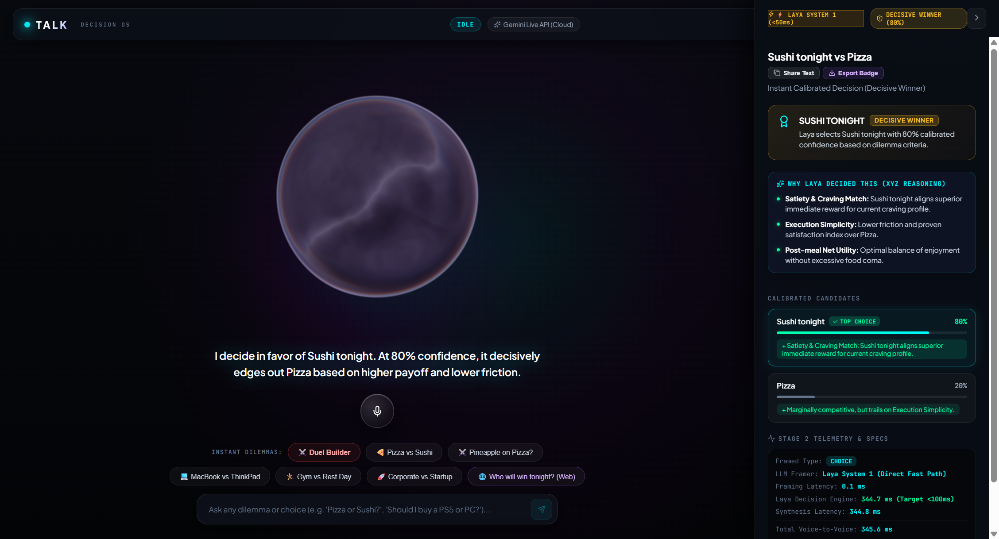
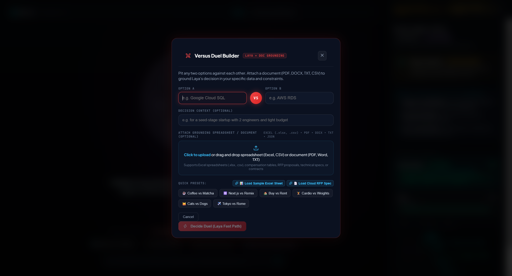
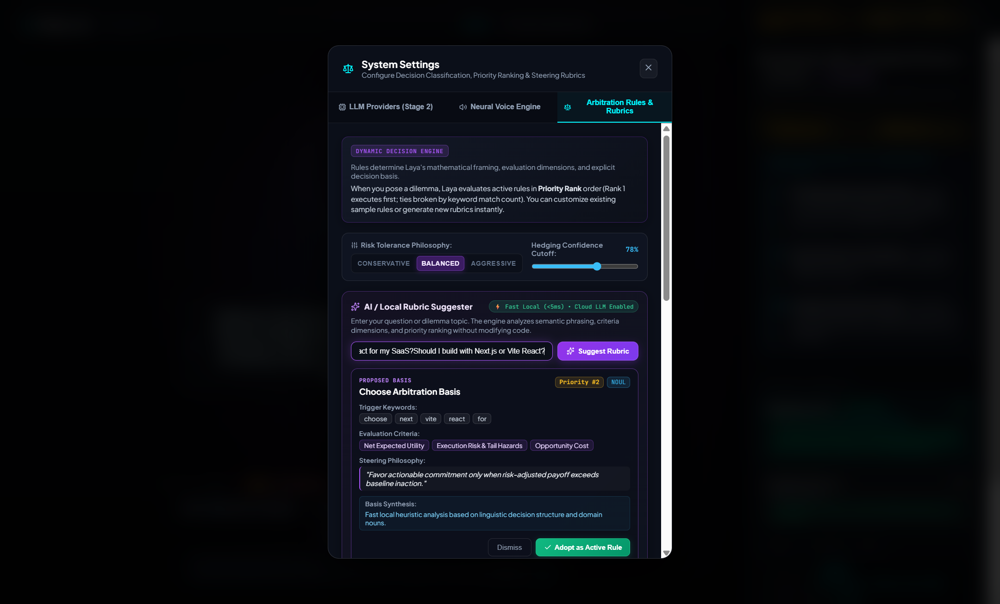

# 🎙️ TALK — A Decision Making Model Leveraging Laya (Jev AI under development)

<p align="center">
  
</p>

<p align="center">
  <a href="https://github.com/navzar81-dev/TALK---A-Decision-Making-Model-Leveraging-Laya-and-Jev-/stargazers"></a>
  <a href="https://github.com/navzar81-dev/TALK---A-Decision-Making-Model-Leveraging-Laya-and-Jev-/network/members"></a>
  <a href="https://github.com/navzar81-dev/TALK---A-Decision-Making-Model-Leveraging-Laya-and-Jev-/blob/main/LICENSE"></a>
  
  
  
</p>

---

## 💡 Overview

**TALK** is a voice-first decision operating system engineered to eliminate decision fatigue. Powered by **Laya** (the open-source JEV.AI non-autoregressive decision engine) and coupled with pluggable Cloud LLM research (Gemini API, Ollama, LM Studio), Talk provides instant, statistically calibrated choices with auditable reasoning and dynamic WebGL visual presence.

Traditional generative LLMs take 3 to 8 seconds to generate long text answers with uncertain subjective biases. Talk decouples **decision calibration** from **text synthesis**:
- **System 1 (Instant Laya Engine, < 50ms):** When presented with candidate choices or self-contained context, Laya evaluates the options in a single forward pass without autoregressive token generation.
- **System 2 (On-Demand Cloud LLM Escalation):** If a query demands real-time external facts (e.g., current pricing, sports scores, live news), Talk routes to Gemini for web research, constructs the state, and hands it to Laya for final calibrated scoring.

---

## 🔮 Interactive Visual Tour

### 1. Main Decision Workspace & Calibrated Right Pane
The WebGL liquid orb reacts in real-time to microphone audio and pipeline states (`idle`, `listening`, `thinking`, `speaking`, `error`). The slide-out pane reveals calibrated confidence bars, verdict flavor badges, and 3-pillar XYZ reasoning.


---

### 2. Interactive Versus Duel Builder & Document Grounding
Pit any two choices against each other, set custom constraints, or drag-and-drop complex documentation (`.pdf`, `.docx`, `.xlsx`, `.csv`, `.json`, `.txt`) to anchor decisions with verified citations.



---

### 3. Pluggable LLM Connections & Neural Voice Personas
Easily switch between cloud endpoints (Gemini API) and local LLMs (Ollama, LM Studio, or custom OpenAI-compatible endpoints) with latency testing. Select from distinct neural voice personas (Jarvis, Nova, Executive, Puck, Charon).



---

## ⚡ Core Capabilities

- 🎯 **Statistically Calibrated Confidence:** Non-autoregressive distribution output directly aligned with candidate probability.
- 🏷️ **Verdict Flavor Badges:** Categorized confidence tiers:
  - `≥ 90%`: **Absolute No-Brainer**
  - `≥ 78%`: **Decisive Winner**
  - `≥ 65%`: **Close Call / Leaning**
  - `< 65%`: **Toss-Up / High Dilemma**
- 🏛️ **3-Pillar XYZ Reasoning:** Deconstructs every decision into core analytical pillars:
  1. *Primary Advantage / Craving Match*
  2. *Execution Simplicity & Friction Index*
  3. *Downside Risk Containment & Net Utility*
- 📄 **Multi-Format Document Grounding:** Native parser for PDF, Word documents, Excel workbooks, CSVs, and JSON files to ground decisions on verified evidence.
- 🎙️ **Low-Latency Neural TTS:** Edge-TTS streaming and Gemini Live Voice personas with Barge-in / Interruption handling.
- 🎨 **HTML5 Canvas Social Badge Export:** 1-Click generation of high-resolution decision badges (`.png`) formatted for social sharing.

---

## 📁 Repository Structure

```
TALK---A-Decision-Making-Model-Leveraging-Laya-and-Jev-/
├── backend/                        # FastAPI Backend Application
│   └── app/
│       ├── main.py                 # FastAPI application, CORS, and API routes
│       ├── orchestrator.py         # Dual-path triage (System 1 vs System 2)
│       ├── laya_service.py         # Laya typed-decision engine client & fallback
│       ├── llm_manager.py          # Pluggable LLM connections (Gemini, Ollama, LM Studio)
│       ├── document_parser.py      # Grounding parser (PDF, DOCX, XLSX, CSV, JSON, TXT)
│       ├── voice_service.py        # Neural TTS engine (Edge-TTS & Gemini Live Voice)
│       └── models.py               # Pydantic schemas, telemetry, and response types
│
├── frontend/                       # Vite + React 19 + TypeScript SPA
│   ├── src/
│   │   ├── App.tsx                 # Core application controller & state machine
│   │   ├── App.css                 # Premium glassmorphic dark theme stylesheet
│   │   ├── components/
│   │   │   ├── LiquidOrb.tsx       # 3D fluid sphere with Three.js & noise shaders
│   │   │   ├── RightPane.tsx       # Calibrated cards, XYZ reasoning & telemetry
│   │   │   ├── VersusModal.tsx     # 2-option duel builder with file upload
│   │   │   └── SettingsModal.tsx   # LLM endpoints and voice persona configurator
│   │   ├── utils/
│   │   │   ├── audio.ts            # Web Audio API real-time FFT analyzer
│   │   │   └── cardExporter.ts     # High-DPI Canvas decision badge export (.png)
│   │   ├── types.ts                # TypeScript interfaces and telemetry contracts
│   │   └── main.tsx                # React DOM entry point
│   ├── vite.config.ts              # Vite server configuration (Strict Port: 5190)
│   └── package.json                # Frontend dependencies
│
├── docs/                           # Documentation & Assets
│   └── assets/                     # High-resolution screenshots & badges
│
├── start-dev.bat                   # 1-Click Windows batch script to launch both servers
├── start-dev.ps1                   # 1-Click PowerShell launcher script
├── talk-app-prd.md                 # Product Requirements Document & specs
├── .gitignore                      # Git exclusion rules
└── README.md                       # Complete end-to-end documentation
```

---

## 🔌 Port Allocation & Isolation

Talk strictly isolates its network boundaries to avoid collisions with other audio or AI runtimes:

| Service | Port | Endpoint URL | Purpose |
|---|---|---|---|
| **Frontend UI** | `5190` | `http://localhost:5190` | Vite React development server |
| **Backend API** | `8001` | `http://127.0.0.1:8001` | FastAPI orchestration, document parsing, TTS streaming |
| **Laya Service** | `8000` | `http://localhost:8000` | Laya typed-decision engine (optional / fallback active) |

---

## 🚀 Quick Setup & Installation

### 1. Clone the Repository
```bash
git clone https://github.com/navzar81-dev/TALK---A-Decision-Making-Model-Leveraging-Laya-and-Jev-.git
cd TALK---A-Decision-Making-Model-Leveraging-Laya-and-Jev-
```

### 2. Prerequisites
- **Python**: 3.10+
- **Node.js**: v18.0.0+ (`npm` included)

---

### Option A: 1-Click Automated Launch (Windows)

From the project root:

**Command Prompt / PowerShell:**
```powershell
.\start-dev.bat
```
*Or with PowerShell script:*
```powershell
.\start-dev.ps1
```

This immediately spins up both development servers in separate, dedicated terminal windows!

---

### Option B: Manual Step-by-Step Setup

#### 1. Backend Setup
```bash
cd backend

# Install required Python dependencies
pip install fastapi uvicorn httpx pydantic pdfplumber python-docx openpyxl edge-tts

# Start the FastAPI server on port 8001
python -m uvicorn app.main:app --host 127.0.0.1 --port 8001 --reload
```

Verify backend health:
```bash
curl http://127.0.0.1:8001/api/health
```

#### 2. Frontend Setup
In a second terminal:
```bash
cd frontend

# Install Node dependencies
npm install

# Start Vite dev server on isolated port 5190
npm run dev
```

Open your browser at:
👉 **`http://localhost:5190`**

---

## 📡 API Reference

### Health Check
- **`GET /api/health`**
- Returns backend operational status, active LLM connection, and active voice persona.

### Decision Pipeline (Process Turn)
- **`POST /api/talk`**
- Request:
  ```json
  {
    "text": "MacBook Pro M4 vs ThinkPad X1 Carbon for software engineering?",
    "session_id": "session-default",
    "document_text": null
  }
  ```
- Response: Returns `TalkResponse` with triage classification, spoken answer, calibrated confidence, verdict flavor, XYZ reasoning, and telemetry metrics.

### Document Parsing & Grounding
- **`POST /api/documents/parse`**
- Multipart Form: Accepts `.pdf`, `.docx`, `.xlsx`, `.csv`, `.json`, `.txt` files with optional option overrides.

### Neural Audio Synthesis
- **`POST /api/voice/speak`**
- Streams real-time MP3 neural audio response for playback.

---

## 🛠️ Validation & Testing

```bash
# Frontend build & lint
cd frontend
npm run build
npm run lint

# Backend sanity check
cd backend
python -c "from app.main import app; print('Backend loaded successfully!')"
```

---

## 📄 License
Distributed under the [Apache 2.0 License](LICENSE).

## 🤝 Contributing
Contributions, issues, and feature requests are welcome! Feel free to check the [issues page](https://github.com/navzar81-dev/TALK---A-Decision-Making-Model-Leveraging-Laya-and-Jev-/issues).
