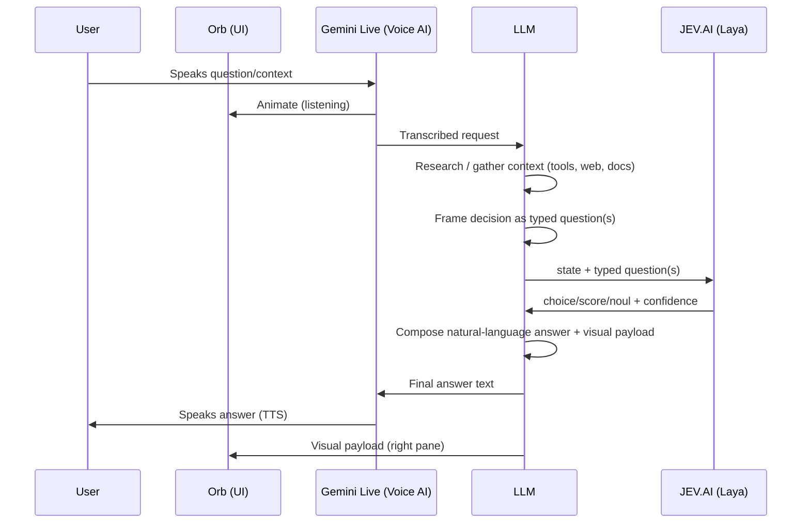

# Product Requirements Document: Talk

**The Instant AI Decision Maker: Fast, Fun, Calibrated Decisions with Live Voice & Orb Interface**

---

## 1. Overview

Talk is a web application designed to be a **lightning-fast, fun, and authoritative decision maker**. Whether settling everyday dilemmas (*"Pizza or sushi tonight?"*, *"MacBook vs ThinkPad?"*), debating hot takes, or weighing high-stakes career/investment choices, Talk delivers instant, statistically calibrated decisions backed by concrete reasoning.

**Core Differentiator — Laya-First with Cloud LLM Escalation:**
- **System 1 (Instant Laya Decision, <50ms):** When the user presents a question with clear choices or self-contained context, Laya evaluates the decision immediately in a single forward pass without waiting for slow generative LLM steps.
- **System 2 (On-Demand Cloud LLM Research):** If and only if Laya detects missing factual context or requires real-time information (e.g. current events, sports scores, live market pricing), it escalates to a Cloud LLM (Gemini) to perform a quick web search, formulate the state, and hand it back to Laya for final calibrated scoring.
- **Zero Local Footprint:** Designed to run 100% in the cloud / web browser — no local GPUs, Ollama, or local daemons required.

## 2. Goals / Non-Goals

**Goals (v1)**
- Natural, low-latency spoken conversation (no push-to-talk friction)
- Answer general "help me decide" questions using real research, not just LLM priors
- Make the decision step fast, auditable, and confidence-scored
- Show supporting visuals (data, comparisons, sources) without breaking the voice flow

**Non-goals (v1)**
- Multi-turn task execution / agentic actions (booking, sending, editing external systems)
- Persistent memory of prior sessions
- Native mobile/desktop apps (web only, per platform decision)
- Multi-user / team accounts

### 2.1 Recommended Pilot Scope

"General purpose decisions" is hard to validate — there's no way to build a real eval set for how well the LLM frames questions for Laya without a bounded domain. Recommend piloting in a domain you already operate in (e.g., training-ops prioritization calls, vendor/batch decisions) before opening the assistant up to arbitrary questions. This gives a concrete set of good-vs-bad framings to tune against.

## 3. Architecture

### 3.1 The four components

| Component | Role | Technology |
|---|---|---|
| **Voice AI** | STT + TTS, low-latency realtime audio in/out | Gemini Live API |
| **LLM** | Understands intent, researches/analyzes, and *frames the decision* as typed question(s) | Pluggable provider — default **Gemini API**; swappable via Settings (see §3.6) |
| **JEV.AI (decision engine)** | Fast, calibrated typed decision over the LLM's framed question(s) | Self-hosted **Laya** (open-source, Apache 2.0) |
| **Orb + right pane** | Visual presence + supporting visuals | Custom WebGL/Canvas orb; right pane renders charts/cards/sources |

### 3.2 Why the LLM↔JEV.AI handoff isn't a simple pipe

Laya (the JEV.AI implementation) is a **non-autoregressive typed-decision engine** — it does not generate free text. It answers three question types over a piece of text ("state"):
- `choice` — pick the best of N labeled options
- `score` — rate on an ordinal rubric
- `noul` — calibrated yes/no probability

This means the LLM has two jobs, not one:
1. **Before Laya:** research the request, then *frame it* as one or more typed questions with explicit options/criteria (dynamically, per your decision — no fixed template library)
2. **After Laya:** take Laya's structured, calibrated answer (label + confidence, or score + distribution) and turn it into a natural spoken sentence

This is what makes the decision stage fast (~33ms) and auditable (confidence scores are statistically calibrated), instead of just another LLM guess.

### 3.3 End-to-end flow

### 3.4 Query triage (before research)

Not every spoken request is a decision. Before the research step, the LLM classifies the request as **decision** vs. **informational/conversational**. Only decision-type queries continue to Laya; informational queries are answered directly by the LLM. This avoids forcing false rigor and extra latency onto simple factual asks, and resolves what was previously an open question in this PRD.

### 3.5 Right-pane visuals
The LLM emits a structured visual payload alongside the spoken answer when relevant: comparison tables, option cards with Laya's per-option confidence, source citations, or simple charts. Nothing is shown if the answer is purely conversational.

### 3.6 Pluggable LLM Provider Layer

The orchestration backend talks to the LLM through a single internal interface (chat/completions + tool-calling + streaming), so the research/framing model is swappable without touching pipeline logic.

**Supported connection types:**
- **Hosted APIs:** Gemini API (**default**), OpenAI, Anthropic, or others added via the same adapter pattern
- **Local/self-hosted:** Ollama (`http://localhost:11434/v1` or custom host) and LM Studio (`http://localhost:1234/v1`) — both expose OpenAI-compatible chat/completions endpoints, so one "OpenAI-compatible" adapter covers most local setups
- **Custom:** any OpenAI-compatible endpoint (e.g., self-hosted vLLM)

**Per-connection config:** name, provider type, base URL, API key (optional for local), model identifier, default flag.

**Settings UI:** add/edit/remove LLM connections, a "test connection" action (ping + minimal completion call), and a default selector — ships pointed at Gemini API on first install.

**Capability flags:** each connection is tagged with whether it supports tool-calling and streaming (surfaced automatically where possible, overridable). Many local models handle tool-calling unreliably — the app should warn if the selected connection lacks confirmed tool-calling support, since that step is required for both research and Laya question-framing.

**Fallback:** if the configured LLM is unreachable or errors mid-session, the pipeline falls back to the default Gemini API connection (or surfaces a clear error) — consistent with the Failure Handling behavior in §5.

## 4. Functional Requirements

**MVP (P0)**
- Continuous voice session via Gemini Live (barge-in / interruption supported)
- Orb states: idle, listening, thinking, speaking, error (distinct visual/audio cues per state)
- Live transcript displayed under the orb as speech is recognized, so the user can confirm what was heard before the pipeline runs
- **Query triage:** LLM first classifies the request as decision vs. informational/conversational; only true decisions route through Laya — this resolves the "does the LLM always call Laya" question from v1
- LLM research step with at least web search as a tool
- Dynamic typed-question framing → Laya call → response synthesis
- Self-hosted Laya service (`laya-serve`) reachable by the LLM as a tool
- **Confidence-aware phrasing:** low-confidence Laya results are spoken with hedging language ("leaning toward X, but it's close"); high-confidence results are stated directly
- Streamed "thinking" filler (visual + optional spoken acknowledgment) the moment research/decision work begins, to mask pipeline latency
- Text-input fallback alongside voice, for noisy environments, sensitive topics, or debugging
- **Settings section:** manage LLM provider connections (Gemini API default; add/edit OpenAI-compatible endpoints for Ollama, LM Studio, or other hosted/local providers), with a default connection and test-connection action
- Right pane: renders text cards, comparison tables, and confidence bars
**Core Completed Features**
- Instant Laya-First decision path (<50ms) with calibrated probability and verdict flavor pills
- Interactive Versus Duel Builder (`[ Option A ] VS [ Option B ]`) with contextual constraints
- Multi-format Document Parser & Grounding Engine (PDF, DOCX, TXT, CSV, JSON) using `pdfplumber` and `python-docx`
- Live external web search grounding and verified citations (Wikipedia & Gemini Search Grounding)
- HTML5 Canvas high-resolution social shareable decision badge generator (`.png`)
- Dedicated Port 5190 isolation preventing conflicts with other local audio/voice services

**P1**
- Multi-question decisions (Laya batch scoring for multi-criteria decisions in one pass)
- User-adjustable voice/response speed
- Caching / short-circuiting repeat or near-duplicate questions within a session
- Auto-detected tool-calling/streaming capability flags per LLM connection

**P2**
- Session history / resume across browser reloads
- Multi-document folder ingestion with embedding vector retrieval

## 5. Non-Functional Requirements

| Concern | Target |
|---|---|
| Voice round-trip latency (perceived) | < 2.5s from end-of-speech to start-of-TTS for simple queries |
| Laya decision latency | < 100ms (self-hosted, GPU preferred; CPU acceptable at higher latency) |
| LLM research latency | Dominant cost — cap tool-use loops, stream partial "thinking" state to orb |
| Availability | Best-effort for v1 (single-region, no HA requirement yet) |
| Language | English v1; Laya's multilingual checkpoint and Gemini Live's multilingual support make later expansion low-cost |

### Failure Handling & Graceful Degradation
Every stage needs a defined fallback rather than a stall:
- **Web search fails/times out:** LLM answers from its own knowledge, marked as "unverified" in the spoken/visual response
- **Laya times out or errors:** degrade to a plain LLM answer, phrased as an opinion rather than a decided outcome
- **High-cardinality decision (20+ options):** shortlist first (`predict_shortlist`), then fine-score the shortlist, rather than scoring all options in one pass
- **Misheard input / low STT confidence:** orb enters an explicit "unsure" state and asks the user to repeat, instead of guessing silently
- **Mid-answer interruption (barge-in):** cancel in-flight tool calls/TTS cleanly and restart the pipeline on the new input, rather than queuing both answers

## 6. Tech Stack (proposed)

- **Frontend:** Web app (React), WebGL/Canvas orb reactive to audio amplitude + pipeline state
- **Voice:** Gemini Live API (browser client, streaming audio in/out)
- **LLM orchestration:** Backend service (Node/Python) holding the LLM session, tool definitions (web search, Laya call), and conversation state, behind a provider-agnostic adapter (OpenAI-compatible interface) supporting Gemini API (default), other hosted APIs, and local servers (Ollama, LM Studio)
- **Decision engine:** Self-hosted `laya-serve` (FastAPI + Router, `LAYA_PRELOAD=1`), called via its `/v1/systemone` endpoint
- **Right pane:** Same frontend, driven by structured JSON payload from the LLM turn

## 7. Success Metrics

- Time from question end to spoken answer start
- % of decisions where Laya confidence ≥ 0.85 (auto-answer) vs. low-confidence (flagged/hedged in the spoken answer)
- Session completion rate (user doesn't abandon mid-answer)
- Qualitative: does the answer *sound* decided, not just informed?

## 8. Risks & Open Questions

- **Laya's high-cardinality limit:** questions with 20+ options need shortlisting (`predict_shortlist`) or a coarse-then-fine split — the LLM's question-framing step must respect this
- **Hosting Laya:** needs a GPU host for production latency (CPU works but is 6–10x slower on cold switches)
- **Barge-in UX:** if the user interrupts mid-TTS, how does the pipeline cancel/resume gracefully?
- **Right-pane payload schema:** needs to be defined jointly with the LLM's system prompt so output is reliably structured
- **Local LLM variability:** Ollama/LM Studio models vary widely in tool-calling reliability and latency depending on user hardware — the question-framing and research steps may degrade on weaker local models even though the connection itself works

**Recommended first pilot:** "general purpose decisions" is too broad to validate cleanly. Narrowing the initial pilot to a bounded domain — e.g., training-ops prioritization or vendor/batch decisions, adjacent to existing Pulse AI / People Forum-style work — makes it possible to build a real eval set of good vs. bad Laya question-framings before opening the assistant up to arbitrary questions.

## 9. Out of Scope (v1)
Desktop app, offline mode, team/multi-user, persistent long-term memory, non-English languages, agentic actions on external systems.
